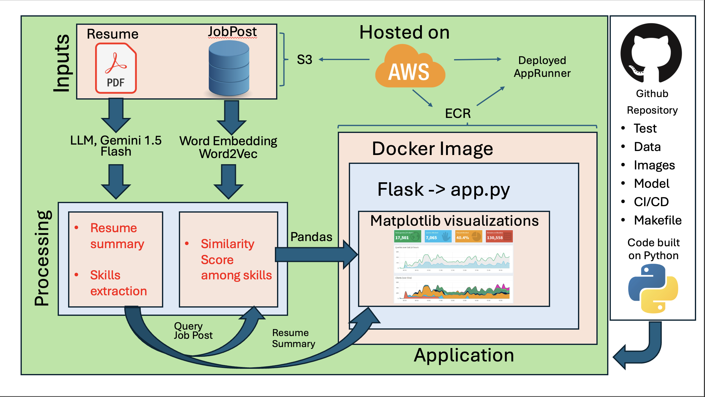
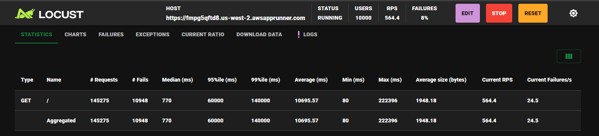
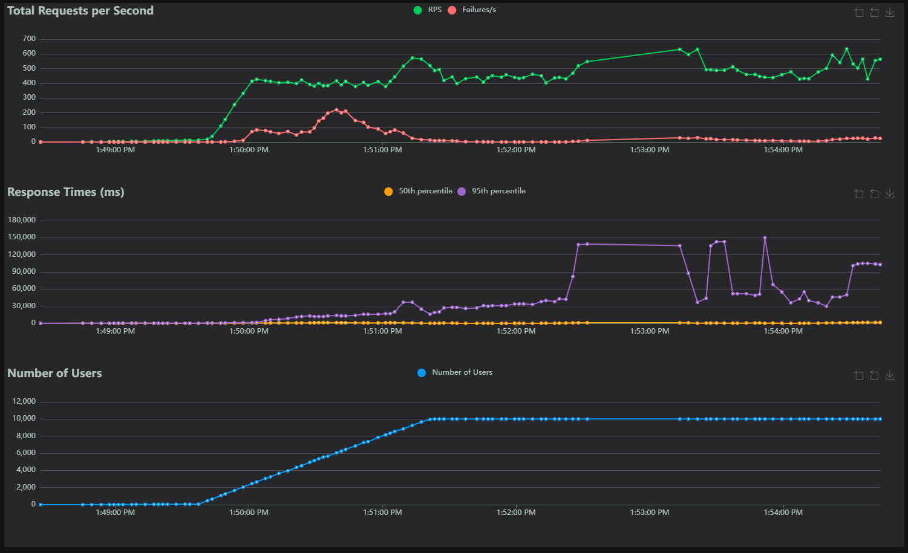

# IDS 706 - Career Catalyst

Adil Gazder, Diego Rodriguez, Meron Gedrago, Yirang Liu

Submitted as part of the final project for IDS 706 (Data Engineering), Fall 2024, Duke University.

# About the Project

**Overview**: This project leverages Natural Language Processing (NLP) techniques to analyze and classify job descriptions from a comprehensive dataset of over 124,000 LinkedIn job postings spanning 2023-2024. By employing document classification algorithms such as Latent Dirichlet Allocation (LDA) and pre-trained language models, we aim to identify key role-specific requirements, including skills, experience, and industry focus. The project’s ultimate goal is to provide actionable insights into the evolving demands of various roles within the U.S. labor market, highlighting trends across job titles, industries, and locations.

**Problem Statement**: Current job seekers often face challenges in understanding and categorizing the critical attributes required in the modern U.S. job market. These include essential skills and industry-specific requirements. This lack of clarity can hinder effective job searches and career planning, necessitating a data-driven approach to elucidate these attributes.

**Proposed Solution**: We implemented an NLP framework to analyze and classify job descriptions using the following methodologies:

- Document Classification Algorithms: Utilize LDA to uncover latent topics within job descriptions.

- Pre-trained Language Models: Leverage advanced NLP models (Google Gemini) to extract and categorize critical job attributes with high accuracy.

# Architecture

Languages: Python, HTML

Infrastructure: Makefile, Docker, YAML, AWS CLI

# Performance

The deployed website (using AWS App Runner) can be accessed here: https://fmpg5qftd8.us-west-2.awsapprunner.com/

We also tested the website's performance using Locust, and were able to achieve 564 requests per second (RPS) with our deployment. This limit was attributed to the restrictions on API rate limits from Google Gemini API's and AppRunner response imitations.

